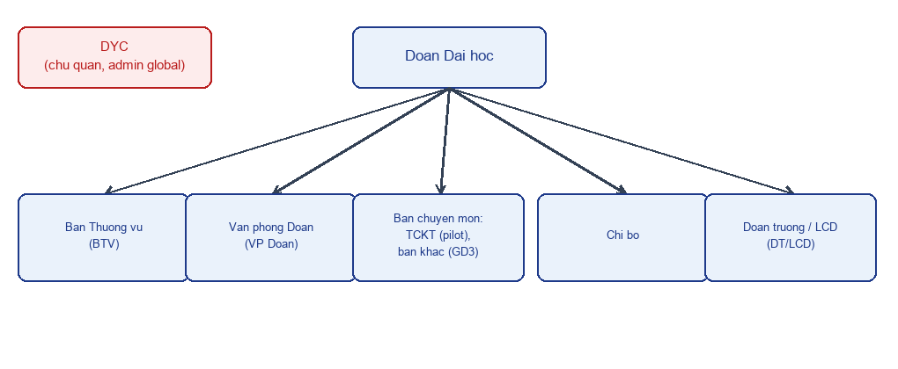

# Cơ cấu đơn vị và vai trò

Tài liệu này giúp BA hiểu cây tổ chức mà nền tảng hướng tới, vai trò của từng đơn vị, và phạm vi quyền nghiệp vụ tương ứng. Phần lớn nội dung dưới đây là **thiết kế kế hoạch (GĐ1)**, không phải hiện trạng code — phần "đã làm" được ghi rõ ở mục 3.

## 1. Cây đơn vị (kế hoạch)



```
[DYC] — chủ quản nền tảng (độc lập, ngoài cây Đoàn)

Đoàn Đại học
├── Ban Thường vụ (BTV)
├── Văn phòng Đoàn (VP Đoàn)
├── Các Ban chuyên môn
│   ├── Ban Tổ chức – Kiểm tra (TCKT)
│   └── Các ban khác                      (kế hoạch GĐ3)
├── Chi bộ                                (quan sát hồ sơ Đảng)
└── Đoàn trường / Liên chi đoàn (ĐT/LCĐ)  (chung một nhóm role)
```

| `kind` (loại đơn vị) | Đơn vị | Vai trò trong đơn vị |
|---|---|---|
| `platform_owner` | DYC | `dyc_admin`, `dyc_engineer` |
| `standing_committee` | BTV | `btv_lead`, `btv_member` |
| `department` | TCKT (các ban khác ở GĐ3) | `admin`, `vice_admin`, `leader`, `vice_leader`, `member` |
| `office` | Văn phòng Đoàn | `officer` |
| `party_cell` | Chi bộ | `observer` |
| `grassroots` | ĐT/LCĐ | `officer` |

Một người có thể thuộc nhiều đơn vị cùng lúc; vai trò gắn với **từng membership** (đơn vị + vai trò), không gắn cứng vào tài khoản.

## 2. Quyết định nghiệp vụ đã chốt (2026-09-23)

- **DYC là admin toàn cục**: đọc được mọi dữ liệu nghiệp vụ của mọi đơn vị, kể cả hồ sơ CTD — kèm ghi vết truy cập (audit log) cho mỗi lượt đọc liên đơn vị. Phân cấp quyền xem nội bộ trong DYC (không phải ai trong DYC cũng nên xem hồ sơ CTD) chưa chốt, để thiết kế sau.
- **Quyền truy cập tab CTD trong nội bộ TCKT**: chỉ nhóm **từ tổ phó trở lên** (`vice_leader`, `leader`, `vice_admin`, `admin`) mới có quyền vào tab Công tác Đảng; role `member` không có quyền này. Phía CTD, nhóm TCKT có quyền này được ánh xạ sang vai trò `tckt` (đã xác nhận đúng với `Role.TCKT` trong `services/ctd-api/backend/app/models/identity.py`).
- **Mức xem liên đơn vị cấu hình được** (không sửa code khi đổi chính sách): 3 mức cố định — `summary` (tổng quan), `tasks_readonly` (thêm task/assignee chỉ đọc), `full_readonly` (thêm checklist/bình luận/đính kèm/nhật ký trực ban chỉ đọc). Mặc định BTV → TCKT ở mức `summary`.

## 3. Đã làm vs. kế hoạch

### Đã làm (RBAC một-ban trên `users.role`, dần chuyển sang `unit_memberships`)

Phần vận hành TCKT (`core/src/policies/access.js`, `core/src/middleware/auth.js`) vẫn dùng 5 vai trò cũ để tính phạm vi xem/sửa nghiệp vụ, nhưng nguồn quyền cho route Điều hành đã chuyển sang bảng `unit_memberships` (GĐ1-A Task 4–5, xem `docs/dev/phan-quyen.md`):

- 5 vai trò: `admin`, `vice_admin` (Ban điều hành, toàn quyền — hàm `isExecutive`), `leader`, `vice_leader` (Tổ trưởng/phó, quản lý Tổ mình — gộp cùng `isExecutive` thành `isLeadership`), `member` (thành viên thường). `users.role` **giữ trong GĐ1** như bản sao đồng bộ một chiều của membership TCKT, không còn là nguồn quyền chính.
- Vai trò được **tự động tính lại** mỗi khi vai trò trong Tổ (`user_teams.is_lead` / `is_vice_lead`) thay đổi (xem `core/src/routes/teams.js`), và đồng bộ sang `unit_memberships` qua `syncTcktMembershipFromRole`.
- Phạm vi xem/sửa **trong một đơn vị** vẫn qua các hàm thuần trong `access.js`: `activityScope`, `canManageTeam`, `canManageActivity`, `canReviewTask`, `canManageUser`, v.v. — đây là các hàm sẽ được refactor thành `scopeFor(viewer, resourceType)` đa đơn vị khi GĐ1 triển khai tiếp.
- Bảng `org_units`, `unit_memberships`, `audit_logs` **đã có** trong `core/db.sql`/migration (GĐ1-A Task 2–4). `unit_visibility_policies`, `setting_locks` — xem tiến độ ở kế hoạch bên dưới.
- **DYC là admin toàn cục** đã làm **một phần**: route Điều hành cũ (`core/src/middleware/legacy-gate.js`, `LEGACY_PREFIXES`) cho DYC đọc (không ghi) dữ liệu TCKT, ghi `audit_logs action='cross_unit_read'` mỗi lượt đọc. Chưa mở rộng sang CTD, chưa có phân cấp quyền xem nội bộ trong DYC.

### Kế hoạch (GĐ1, chưa có code)

Hàm `scopeFor(viewer, resourceType)` thay thế các hàm trong `access.js`, bảng `unit_visibility_policies`/`setting_locks`, và luồng giao việc liên đơn vị (directive)/Trình (submission) — xem `.kiro/specs/nen-tang-da-don-vi/design.md` §5–§8 và use case vận hành ở [`dieu-hanh-use-case.md`](dieu-hanh-use-case.md).

## 4. Lưu ý quan trọng — dữ liệu ĐT/LCĐ trong GĐ1 là giả định

**Trong Giai đoạn 1 (GĐ1), danh sách Đoàn trường/Liên chi đoàn (ĐT/LCĐ) và cán bộ phụ trách thực tế trong phần Điều hành là dữ liệu giả/placeholder, chưa phải danh sách thật.** Đây là một câu hỏi còn mở, chưa chốt (xem `.kiro/specs/nen-tang-da-don-vi/design.md` §13): danh sách ĐT/LCĐ và cán bộ phụ trách thực tế còn thiếu, cần dữ liệu thật trước khi seed migration chính thức. ĐT/LCĐ chỉ dùng module CTD ở GĐ1; việc dùng module Điều hành được xếp vào GĐ3.

BA khi viết use case hoặc kịch bản demo liên quan tới ĐT/LCĐ trong phần Điều hành cần nêu rõ đây là dữ liệu giả định, không suy diễn thành yêu cầu nghiệp vụ đã xác nhận.

## 5. Ánh xạ vai trò Core → CTD (kế hoạch)

| Core (`kind`, role) | Vai trò CTD |
|---|---|
| `grassroots`, `officer` (ĐT/LCĐ) | `can_bo_don_vi` |
| `department` TCKT (tổ phó trở lên) | `tckt` |
| `office`, `officer` (VP Đoàn) | `vp_doan` |
| `party_cell`, `observer` (Chi bộ) | `chi_bo` |
| `standing_committee` (BTV) | không có vai trò CTD, chỉ gọi được `/summary` |
| `platform_owner` (DYC) | `quan_tri` (admin toàn cục phía CTD) |

## Lịch sử phiên bản

| Version | Ngày | Thay đổi | Người |
|---|---|---|---|
| 1.0 | 2026-09-24 | Bản đầu (viết lại từ tài liệu cũ khi gộp monorepo) | DYC |
| 1.1 | 2026-09-24 | Cập nhật mục 3 "Đã làm": `unit_memberships`/`audit_logs` đã có, nguồn quyền route Điều hành chuyển sang `unit_memberships`, "DYC là admin toàn cục" đã làm một phần qua `legacyGate` (nợ tài liệu từ GĐ1-A Task 4, khớp luôn khi Task 5 sửa `auth.js`-liên quan) | DYC |
