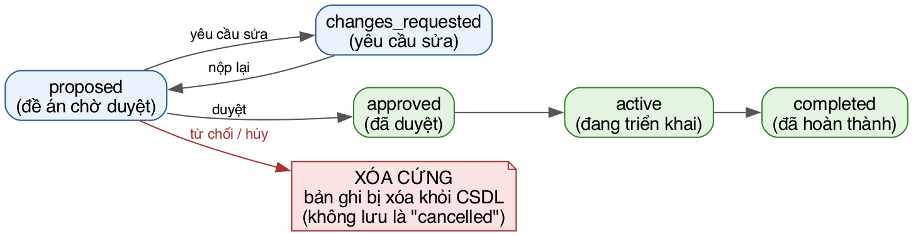
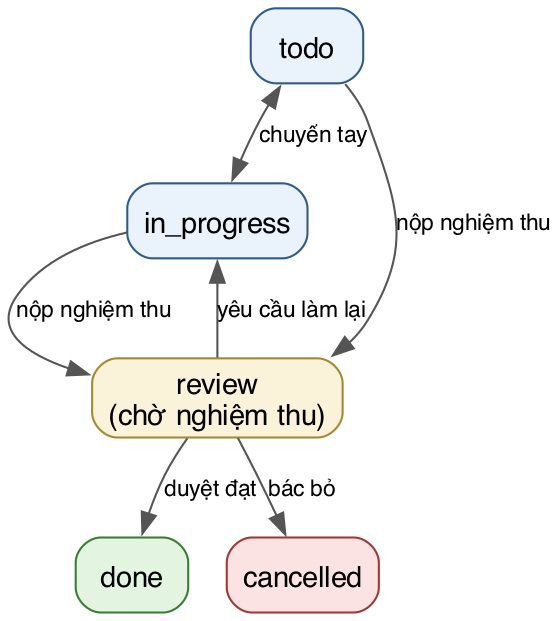
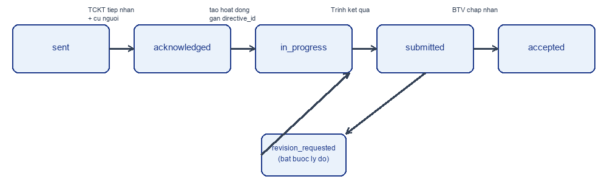

# Use case điều hành hoạt động TCKT

Tài liệu này mô tả các luồng nghiệp vụ vận hành hoạt động/công việc của TCKT — phần **module Điều hành** đã chạy thật. Nội dung được đối chiếu trực tiếp với `core/src/routes/activities.js`, `tasks.js`, `reports.js` để đảm bảo đúng những gì hệ thống thực sự làm, không chỉ theo tài liệu cũ.

## 1. Vai trò tham gia

- **Trưởng ban / Phó ban** (`admin`/`vice_admin`) — toàn quyền: duyệt đề án, quản lý tài khoản/Tổ, xem mọi báo cáo.
- **Tổ trưởng / Tổ phó** (`leader`/`vice_leader`) — lập đề án, giao việc, nghiệm thu trong phạm vi Tổ mình phụ trách.
- **Thành viên** (`member`) — nhận việc, cập nhật checklist, nộp sản phẩm để nghiệm thu, tự ghi nhận việc phát sinh.
- **Trưởng Ban Tổ chức hoạt động (Event Lead)** — vai trò theo ngữ cảnh từng hoạt động: dù tài khoản có role `member`, người được gắn làm Event Lead của một hoạt động vẫn được giao việc/nghiệm thu task thuộc hoạt động đó.

## 2. Luồng đề xuất & phê duyệt hoạt động — đã làm

1. Trưởng ban/Phó ban tạo đề án (`POST /api/activities`): tên, mô tả, loại (`event`/`assigned`), Tổ chủ trì + Tổ phối hợp, thời gian, người yêu cầu, địa điểm, Event Lead. Trạng thái ban đầu `proposed`.
2. Hệ thống phát sự kiện `activity.proposed` — Rule Engine gửi thông báo tới nhóm điều hành (`admin`, `vice_admin`).
3. Ban điều hành thao tác trên đề án qua 3 route riêng biệt:
   - `POST /api/activities/:id/approve` → `approved`.
   - `POST /api/activities/:id/reject` → `cancelled`/từ chối.
   - `POST /api/activities/:id/request-changes` → `changes_requested`, bắt buộc kèm ghi chú.
4. Khi ở trạng thái `changes_requested`, Tổ chủ trì sửa và `POST /api/activities/:id/submit` để đưa về `proposed`.
5. Chỉ `admin`/`vice_admin` (`isExecutive`) mới được đổi `status`/`event_lead_id` qua `PATCH /api/activities/:id`; Tổ trưởng/phó chỉ được sửa các trường mô tả (`priority`, `result_summary`, `title`, `description`, `type`, `deadline`, `start_date`, `location`, `requested_by`) và chỉ trên hoạt động mình quản lý (`canManageActivity`).

**Quy tắc không hiển nhiên cần biết trước khi sửa code:**
- Hoạt động chuyển sang `cancelled` qua `PATCH .../status` → **xoá cứng vĩnh viễn** toàn bộ dữ liệu liên quan (task, minh chứng, người tham gia…), không có thùng rác (`hardDeleteActivity`).
- Đổi Tổ phối hợp của hoạt động bị chặn (`409`) nếu một Tổ đang có task gắn với hoạt động đó — phải chuyển task trước.

## 3. Luồng bóc tách, giao việc & xác nhận nhận việc — đã làm

1. Lead tạo task trong hoạt động đã duyệt (`POST /api/activities/:id/tasks`), chỉ định 1 **Primary Assignee** + các người phối hợp (co-assignees), thêm checklist con.
2. Hệ thống phát `task.assigned` tới các assignee.
3. Thành viên bấm **Xác nhận nhận việc** (`POST /api/tasks/:id/acknowledge`) → ghi `task_assignees.acknowledged_at`.
4. Nếu sau 24 giờ thành viên chưa xác nhận, hệ thống phát `task.unacknowledged` cho Lead giao việc (qua cron nhắc việc).
5. Task tự ghi nhận việc phát sinh (`Self-Log Work`, không thuộc kế hoạch ban đầu) qua `POST /api/activities/:id/log-task`, có trọng số 0–10 lấy từ danh mục `weight_presets` và minh chứng.

## 4. Luồng thực hiện & nghiệm thu — đã làm

Task đi qua 4 cột: `todo` → `in_progress` → `review` → `done`.

- Thành viên **không được** tự chuyển task sang `done`. Muốn chuyển, phải qua `POST /api/tasks/:id/submit-review` (bắt buộc ít nhất 1 link hợp lệ `http(s)://` hoặc 1 file đính kèm, kèm ghi chú bàn giao) → trạng thái tự chuyển `review`.
- Người có quyền nghiệm thu (`canReviewTask` trong `access.js`: nhóm điều hành, Tổ trưởng/phó của Tổ phụ trách task, hoặc Event Lead của hoạt động) duyệt qua `POST /api/tasks/:id/review`:
  - Duyệt đạt → `done`, ghi `reviewed_at`/`reviewed_by`, hệ thống đối chiếu với `deadline` để phân loại đúng hạn/trễ hạn.
  - Yêu cầu làm lại → quay về `in_progress`, bắt buộc nhập `review_feedback`.
- **Anti-Self-Review**: thành viên thường (`member`) không tự nghiệm thu được task của chính mình; nhóm điều hành, Tổ trưởng/phó (cho task trong Tổ mình), và Event Lead (cho task trong hoạt động mình phụ trách) được phép bypass quy tắc này.
- Task bị huỷ (`POST /api/tasks/:id/cancel`) **không xoá cứng**, chỉ ẩn khỏi thống kê hoạt động.

## 5. Luồng báo cáo & lưu trữ — đã làm

- `GET /api/archive` — danh sách hoạt động đã `completed`, có thể tìm theo từ khoá, xem lại `result_summary`.
- `GET /api/reports/export` (chỉ `manager` trở lên) — xuất báo cáo Excel qua thư viện `exceljs`.
- Dashboard tổng quan và thống kê KPI cá nhân theo tài liệu nghiệp vụ gốc (`TCKT_REQUIREMENTS_SPEC.md` mục E, F) mô tả thêm: KPI widget (số hoạt động đang chạy, việc quá hạn, việc khẩn cấp), Master Calendar/Gantt có cảnh báo trùng lịch, trang "Việc của tôi hôm nay". Các phần này cần đối chiếu lại route thực tế trước khi coi là "đã làm" đầy đủ — tài liệu này chỉ xác nhận các luồng ở mục 2–4 và xuất Excel ở trên qua code.

## 6. Thông báo — đã làm

Toàn bộ sự kiện nghiệp vụ (đề án mới/duyệt/từ chối/yêu cầu sửa, giao task, phản hồi task, nộp nghiệm thu, kết quả nghiệm thu, sắp đến hạn, quá hạn, chưa xác nhận nhận việc) được emit qua Rule Engine (`emailEvents.emit`, xem `core/src/config/migrate.js` mục seed template/rule mặc định) — gửi cả kênh in-app và email, thay thế toàn bộ hệ thống mailer cũ.

## 7. Giao việc liên đơn vị (directive) và Trình (submission) — kế hoạch, chưa có code

Hai luồng nghiệp vụ mới cho quan hệ BTV ↔ TCKT, **chưa có bảng dữ liệu hay route nào trong code hiện tại**:

- **Giao việc (directive)**: `sent` (BTV giao) → `acknowledged` (TCKT tiếp nhận, cử người) → `in_progress` (có hoạt động gắn `directive_id`) → `submitted` (TCKT Trình kết quả) → `accepted`/`revision_requested` (BTV phản hồi). Tiến độ (`progress_percent`) tính bằng số task `done` chia cho số task không `cancelled` trên mọi hoạt động gắn directive đó.
- **Trình (submission)**: nút "Trình lên…" trên hoạt động/nhật ký trực ban/báo cáo, chọn đơn vị nhận; rút lại được khi chưa có phản hồi, không rút lại được khi đã có phản hồi.
- **Nhật ký trực ban/họp ban (ops_log)**: ghi bởi `leader` trở lên kèm điểm danh; đơn vị ngoài chỉ thấy khi mức xem `full_readonly` hoặc log đã được Trình.

Chi tiết đầy đủ (acceptance criteria dạng EARS): `.kiro/specs/nen-tang-da-don-vi/requirements.md` Yêu cầu 4–6.

## Lịch sử phiên bản

| Version | Ngày | Thay đổi | Người |
|---|---|---|---|
| 1.0 | 2026-09-24 | Bản đầu (viết lại từ tài liệu cũ khi gộp monorepo) | DYC |
