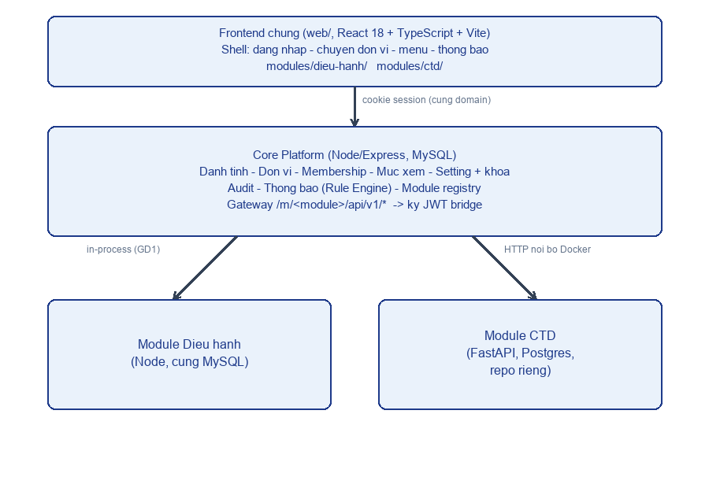

# Tổng quan nền tảng đa đơn vị

Tài liệu này giúp BA và người mới nắm nhanh: hệ thống này phục vụ ai, giải quyết vấn đề gì, và các khối lớn ghép với nhau ra sao — không đi vào chi tiết kỹ thuật (xem `docs/dev/kien-truc.md` cho phần đó).

## 1. Vấn đề cần giải quyết

TCKT Activity Hub (`tckt-activity-hub`, phiên bản `2.1.1`) ban đầu là hệ thống quản lý hoạt động và giao việc **nội bộ một Ban** — Ban Tổ chức – Kiểm tra (TCKT), thuộc Đoàn Đại học. Nó thay thế các kênh phân tán (Zalo, Messenger, Excel) để: chấm dứt tình trạng trôi tin/quên deadline, minh bạch hoá tiến độ theo thời gian thực, số hoá quy trình đề án và nghiệm thu, đo lường công bằng mức đóng góp cá nhân.

Ba nhu cầu mới xuất hiện cùng lúc, khiến việc "vá thêm" không còn đủ, buộc phải thiết kế lại thành **nền tảng đa đơn vị**:

1. **BTV** (Ban Thường vụ) cần giám sát, giao việc và xem báo cáo của TCKT — nhưng BTV là **một đơn vị khác**, chỉ nên thấy những gì mình giao hoặc được TCKT chủ động Trình lên, không phải toàn bộ dữ liệu nội bộ TCKT.
2. **DYC** (Văn phòng Đoàn trường) là đơn vị chủ quản, xây dựng và vận hành nền tảng — độc lập với cây tổ chức Đoàn, và cần toàn quyền truy cập dữ liệu nghiệp vụ để vận hành/hỗ trợ, kèm khả năng khoá một số cấu hình chỉ DYC được sửa.
3. **Công tác Đảng (CTD)** — hệ thống xét duyệt hồ sơ kết nạp/chuyển Đảng đã có sẵn (FastAPI + PostgreSQL, trước đây là repo riêng) — cần được đưa vào chung một cổng làm việc dưới dạng một tab, hiển thị khác nhau tuỳ vai trò, sinh viên không thấy tab này.

## 2. Ai dùng hệ thống

- **DYC** — chủ quản nền tảng, admin toàn cục (xem mọi dữ liệu nghiệp vụ mọi đơn vị, kèm ghi vết truy cập).
- **BTV** — giám sát/giao việc cho TCKT, xem báo cáo ở mức được cấu hình.
- **TCKT** (`admin`, `vice_admin`, `leader`, `vice_leader`, `member`) — vận hành hoạt động/công việc hằng ngày; nhóm từ tổ phó trở lên còn thao tác trên tab CTD.
- **Văn phòng Đoàn, Chi bộ, Đoàn trường/Liên chi đoàn (ĐT/LCĐ)** — dùng tab Công tác Đảng để xử lý hồ sơ kết nạp/chuyển Đảng.
- **Sinh viên** — chỉ nộp hồ sơ Đảng ở trang riêng, không vào cổng quản lý chung.

Chi tiết cơ cấu đơn vị, vai trò và phạm vi quyền: xem [`co-cau-don-vi-va-role.md`](co-cau-don-vi-va-role.md).

## 3. Kiến trúc ở mức nghiệp vụ

Nền tảng gồm một **cổng làm việc chung** (một giao diện web duy nhất, chia theo tab/module) đứng trước hai mảng nghiệp vụ:

- **Core + module Điều hành** — đăng nhập, quản lý đơn vị/thành viên, mức xem liên đơn vị, cấu hình khoá, ghi vết truy cập, và toàn bộ nghiệp vụ vận hành hoạt động của TCKT (đề án, task, nghiệm thu, báo cáo). Đây là phần đã xây dựng và đang chạy — chi tiết ở [`dieu-hanh-use-case.md`](dieu-hanh-use-case.md).
- **Module Công tác Đảng (CTD)** — quy trình xét duyệt hồ sơ Đảng từ lúc sinh viên nộp đến khi chuyển Chi bộ, vận hành như một dịch vụ riêng nối vào cổng chung qua cơ chế xác thực bắc cầu (JWT bridge). Chi tiết ở [`ctd-use-case.md`](ctd-use-case.md).

Về mặt tổ chức: **Điều hành** là phần dùng chung một cơ sở dữ liệu với Core vì đó là code Hub sẵn có; **CTD** tách hẳn thành dịch vụ riêng vì có nhóm người dùng riêng, dữ liệu ít cần kết hợp với phần còn lại, và có quy trình/vòng đời hoàn toàn riêng (tiêu chí tách module cụ thể xem [`../playbooks/them-module.md`](../playbooks/them-module.md)).

## 4. Trạng thái hiện tại — đã làm so với kế hoạch

Đây là điểm quan trọng nhất cần phân biệt khi đọc các tài liệu BA khác:

- **Đã làm (chạy thật, kiểm chứng trong code):** toàn bộ nghiệp vụ vận hành TCKT một-ban (đề án, task/Kanban, nghiệm thu, báo cáo, thông báo email) và toàn bộ quy trình xét duyệt hồ sơ Đảng của CTD (9 trạng thái, các bước chuyển, phân quyền theo vai trò/đơn vị).
- **Kế hoạch (đã chốt thiết kế, chưa có code):** toàn bộ khái niệm đa đơn vị mới — cây đơn vị (`org_units`), thành viên theo đơn vị (`unit_memberships`), mức xem liên đơn vị cấu hình được, DYC admin toàn cục có ghi vết, giao việc liên đơn vị (directive), Trình (submission), nhật ký trực ban/họp ban, và cầu nối JWT sang CTD. Các khái niệm này nằm trong `.kiro/specs/nen-tang-da-don-vi/{requirements.md,design.md}` và **chưa có bảng dữ liệu tương ứng trong `core/db.sql` hiện tại**.

Vì vậy, trong giai đoạn hiện tại (GĐ1), dữ liệu về BTV, DYC và ĐT/LCĐ trong hệ thống vận hành TCKT vẫn là **giả định/placeholder** — xem chi tiết và lý do ở [`co-cau-don-vi-va-role.md`](co-cau-don-vi-va-role.md).

## 5. Thuật ngữ

Xem bảng thuật ngữ đầy đủ ở [`thuat-ngu.md`](thuat-ngu.md).

## Lịch sử phiên bản

| Version | Ngày | Thay đổi | Người |
|---|---|---|---|
| 1.0 | 2026-09-24 | Bản đầu (viết lại từ tài liệu cũ khi gộp monorepo) | DYC |
