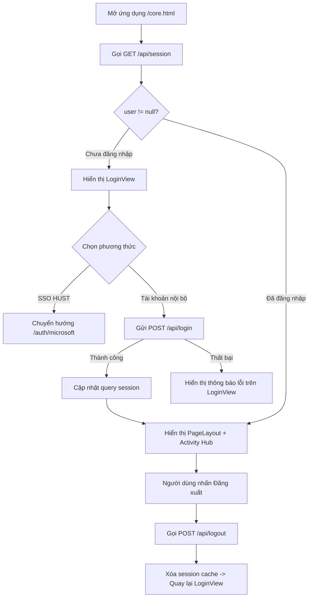

# Thiết kế — Giao diện Đăng nhập Hiện đại cho TCKT Activity Hub (Core Web)

## 1. Mục tiêu và Bối cảnh
- **Mục tiêu**: Xây dựng giao diện đăng nhập hiện đại (`LoginView.tsx`) trên nền React + Atlassian Design System (ADS) trong `web/`, kế thừa hoàn toàn bố cục 2 cột đặc trưng từ giao diện hiện có của TCKT Activity Hub (`core/public/index.html` và ảnh thiết kế `media_1791459774793.png`).
- **Phạm vi**:
  - Giao diện đăng nhập 2 cột: Cột trái (Brand Hero Art với nền gradient sâu, typography ấn tượng, trích dẫn văn hóa và avatar thu nhỏ) và Cột phải (Form đăng nhập ADS với nút Microsoft HUST SSO, form email/mật khẩu, thông báo lỗi).
  - Tích hợp API xác thực backend: Kết nối `POST /api/login`, chuyển hướng `/auth/microsoft`, `POST /api/logout`, và `GET /api/session`.
  - Dev server Vite proxy cả `/api` và `/auth` sang Core (`localhost:3000`). Callback SSO của Core hiện `redirect('/')` về UI cũ (`core/public`) — cho tới khi có quyết định phục vụ `web/`, người dùng SSO sẽ quay về UI cũ.
  - Onboarding bắt buộc của tài khoản HUST: nếu `session.user.onboarding.required`, App hiện `OnboardingView` thay cho giao diện chính — sinh viên khai số lớp (`POST /api/onboarding/student-class`), cán bộ/giảng viên bấm "Tôi đã hiểu" (`POST /api/onboarding/faculty-notice`); xong thì cập nhật `session.user` trong cache và vào Tổng quan.
  - Menu "Báo cáo" trong `PageLayout` và route `#/reports` chỉ dành cho `useCapabilities().isManager` (người khác bị chuyển về dashboard); đã bỏ các mục chưa có chức năng (Thông báo, Cài đặt, Chuyển vai trò, Báo Bug).
  - Kiểm soát phiên (Session Gating): Trong `web/src/core/main.tsx`, kiểm tra phiên người dùng. Nếu chưa đăng nhập thì hiển thị `LoginView`, nếu đã đăng nhập thì hiển thị ứng dụng chính với `PageLayout`.
  - Đăng xuất (`logout`): Thêm nút / menu đăng xuất trên thanh điều hướng `PageLayout` để người dùng có thể thoát phiên làm việc.
- **Ràng buộc bất biến**:
  - Tuyệt đối không thay đổi schema database và không sửa đổi các hợp đồng API đã có của backend `core/`.
  - Không bao giờ chạy lệnh `git push` lên bất kỳ remote nào.
  - Tuân thủ token và styling của Atlassian Design System, hỗ trợ responsive (trên mobile cột trái ẩn hoặc hiển thị gọn).

## 2. Thiết kế Giao diện Chi tiết (`LoginView.tsx`)

### 2.1. Cột trái: Brand Hero Art
- **Background**: Gradient sâu `linear-gradient(145deg, #0f172a, #1e3a8a, #2563eb)` kèm 2 vòng tròn trang trí mờ tinh tế ở các góc.
- **Header**: Logo thương hiệu TCKT:
  - Khối vuông bo góc đen với ký tự `T` màu trắng.
  - Dòng chữ: `TCKT Activity Hub` (hoặc `TCKT Cổng hoạt động`).
- **Nội dung chính**:
  - Eyebrow: `CÙNG LÀM VIỆC · CÙNG GHI NHỚ` (`WORK TOGETHER · REMEMBER TOGETHER`).
  - Tiêu đề lớn (Heading): "Mỗi đóng góp." (màu trắng) + "Một câu chuyện chung." (màu vàng nhạt/vàng ánh kim `#d9bd85` / `#F4C270`).
  - Đoạn mô tả: "Lập kế hoạch hoạt động, phối hợp các Tổ và lưu giữ những đóng góp thúc đẩy cộng đồng sinh viên."
- **Footer**:
  - Cụm avatar thu nhỏ (Mini-avatars): 3 hình tròn xếp chồng nhẹ ("MA", "HN", "BC").
  - Chữ chú thích: "Dành cho Đoàn Thanh niên & Hội Sinh viên".

### 2.2. Cột phải: Form Đăng nhập ADS
- **Cụm thao tác góc trên bên phải (Header Actions)**:
  - Nút chuyển đổi giao diện Sáng / Tối (`ThemeToggle` sử dụng hoạt ảnh Lottie `theme-toggle.json`): Hiệu ứng trượt sống động giữa Mặt trời (chế độ Sáng) và Mặt trăng cùng các vì sao (chế độ Tối).
  - Nút toggle ngôn ngữ (`VN` / `EN`).
- **Phần chào mừng**:
  - Eyebrow: `CHÀO MỪNG TRỞ LẠI` (màu xanh dương thương hiệu `#0052CC`).
  - Tiêu đề H2: `Đăng nhập vào không gian làm việc`.
  - Phụ đề: `Sử dụng tài khoản trường để tiếp tục.`
- **Nút Microsoft HUST SSO**:
  - Nút lớn toàn chiều rộng (Full-width Button) với biểu tượng Microsoft Start hoạt ảnh Lottie (`MicrosoftLottieLogo` dựa trên `microsoft-start.json`), liên kết tới `/auth/microsoft`.
  - Hiệu ứng hoạt ảnh: 4 ô màu đặc trưng (Đỏ, Xanh lục, Xanh lam, Vàng) với hiệu ứng sóng ánh sáng (shine sweep) lướt qua định kỳ sống động.
  - Nhãn: `Đăng nhập bằng tài khoản HUST`.
- **Đường phân cách (Divider)**:
  - Đường line mờ với nhãn ở giữa: `HOẶC SỬ DỤNG TÀI KHOẢN NỘI BỘ`.
- **Thông báo lỗi (Error Alert)**:
  - Khi đăng nhập thất bại (sai email/mật khẩu, lỗi mạng), hiển thị thông báo lỗi màu đỏ (ADS SectionMessage hoặc Banner danger) với nội dung chi tiết từ API (`Email or password is incorrect.`).
- **Các trường nhập liệu (Form Fields)**:
  - `Địa chỉ email`: Textfield với nhãn rõ ràng, placeholder `vidu@hust.edu.vn`, tự động kiểm tra định dạng.
  - `Mật khẩu`: Textfield dạng password, nhãn `Mật khẩu`.
- **Nút Đăng nhập và Hiệu ứng tải (Lottie Loading)**:
  - Nút ADS Primary toàn chiều rộng: `Đăng nhập →`.
  - Có trạng thái tải (`isLoading`) khi đang gửi yêu cầu xác thực tới backend.
  - Khi đang xác thực, hiển thị lớp phủ mờ (backdrop overlay) với hoạt ảnh Lottie Loading cao cấp (`LottieLoading` dựa trên file vector `loading.lottie`), kèm thông điệp "Đang xác thực thông tin..." / "Signing in...".
  - Khi ứng dụng root tải trạng thái phiên ban đầu trong `main.tsx`, sử dụng `<LottieLoading fullScreen message="Đang tải không gian làm việc..." />` thay cho Spinner mặc định.

## 3. Kiến trúc Luồng Dữ liệu và Phiên làm việc (Session Gating)

## 4. Kiểm thử
1. **Unit test API Layer**: Kiểm thử `loginUser` (`POST /api/login`) và `logoutUser` (`POST /api/logout`) thành công và thất bại.
2. **Unit test LoginView, LottieLoading, ThemeToggle & MicrosoftLottieLogo**:
   - Kiểm tra render đầy đủ các thành phần cột trái và cột phải.
   - Kiểm tra submit form với thông tin hợp lệ -> gọi `loginUser` và gọi callback `onLoginSuccess`.
   - Kiểm tra submit form thất bại -> hiển thị thông điệp lỗi.
   - Kiểm tra nút Microsoft SSO trỏ đúng `/auth/microsoft` và chứa biểu tượng hoạt ảnh `MicrosoftLottieLogo`.
   - Kiểm tra component `LottieLoading` hiển thị đúng kích cỡ, thông điệp và container.
   - Kiểm tra component `ThemeToggle` hỗ trợ các thuộc tính chuyển trạng thái ARIA switch (`aria-checked`), callback `onToggle`, và hoạt động tự chủ (uncontrolled).
   - Kiểm tra component `MicrosoftLottieLogo` render kích thước tùy chỉnh và container đúng chuẩn.
3. **Integration test Session Gating**:
   - `main.test.tsx` kiểm tra khi session `user: null` -> render `LoginView`.
   - Khi session `user: { name: 'Admin', ... }` -> render `PageLayout` với các module chính.

## Lịch sử phiên bản

| Version | Ngày | Thay đổi | Người |
|---|---|---|---|
| 1.0 | 2026-10-08 | Khởi tạo thiết kế màn hình đăng nhập hiện đại 2 cột cho TCKT Activity Hub. | DYC |
| 1.1 | 2026-10-08 | Bổ sung hiệu ứng hoạt ảnh Lottie Loading (`loading.lottie`) trong màn hình đăng nhập và khởi tạo ứng dụng. | DYC |
| 1.2 | 2026-10-08 | Bổ sung nút chuyển đổi chế độ Sáng / Tối hoạt ảnh Lottie (`theme-toggle.json`) cho thanh điều hướng và màn hình đăng nhập. | DYC |
| 1.3 | 2026-10-08 | Thay thế logo Microsoft tĩnh bằng logo hoạt ảnh Microsoft Start Lottie (`microsoft-start.json`) trên nút SSO. | DYC |
| 1.4 | 2026-10-08 | Bổ sung tài khoản kiểm thử local (`admin@hust.edu.vn` / `123456`) cùng nút tiện ích Điền nhanh và cơ chế phục hồi đa tầng cho môi trường dev. | DYC |
| 1.5 | 2026-10-08 | Làm sạch dữ liệu kiểm thử local, gỡ bỏ khung tài khoản test trên giao diện và khôi phục mã nguồn backend nguyên bản chuẩn bị đẩy nhánh staging. | DYC |
| 1.6 | 2026-10-09 | Thêm onboarding bắt buộc cho tài khoản HUST, proxy `/auth` cho SSO ở dev, menu Báo cáo theo quyền, bỏ mục menu chưa có chức năng. | DYC |
| 1.7 | 2026-10-09 | Thu hẹp `related_code` về các tệp thực sự do tài liệu này mô tả; SPEC-WEB-003 mở rộng (tài liệu vẫn active); sửa mô tả quyền menu Báo cáo theo `isManager`; lỗi đăng nhập hiện tiếng Việt qua `apiErrorMessage` | DYC |
