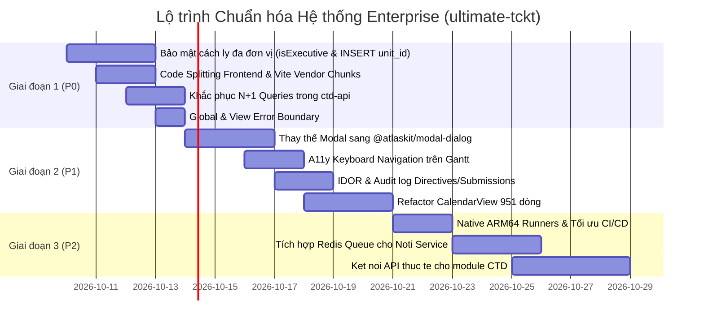

# Đề án Toàn diện: Nâng cấp, Hoàn thiện & Chuẩn hóa Hệ thống Vận hành Enterprise (ultimate-tckt)

> **Mục tiêu:** Nâng cấp toàn diện nền tảng đa đơn vị Đoàn Đại học `ultimate-tckt` từ quy mô pilot/nội bộ lên chuẩn hệ thống doanh nghiệp (Enterprise-grade): hoạt động quy củ, workflow trơn tru 100%, bảo mật tuyệt đối giữa các đơn vị, giao diện công thái học cao cấp và hiệu năng mượt mà.  
> **Căn cứ thực hiện:** Báo cáo kiểm định 360° độc lập từ 4 Sub-agents chuyên gia: Kiến trúc Hệ thống, An ninh & Cách ly Dữ liệu, Tối ưu Hiệu năng, và Atlassian Design System / A11y.

---

## 1. TỔNG QUAN TÌNH TRẠNG & ĐÁNH GIÁ MA TRẬN HỆ THỐNG

| Trụ cột | Đánh giá hiện trạng | Điểm nghẽn then chốt | Mức độ rủi ro |
| :--- | :--- | :--- | :---: |
| **1. An ninh & Cách ly Đa đơn vị** | Đã có `unit-context.js` và `policies/access.js` nhưng tồn tại lỗ hổng nghiêm trọng ở các quyền Executive và câu lệnh INSERT | Lỗ hổng rò rỉ dữ liệu chéo giữa các đơn vị qua `isExecutive` (`/api/people`, `/api/documents`, `/api/reports/export`); tạo mới dữ liệu tự gán về TCKT | **P0 (Khẩn cấp)** |
| **2. Hiệu năng & Kích thước Bundle** | Frontend build Vite cảnh báo bundle > 900 kB; Backend xuất hiện truy vấn lặp | Chưa áp dụng Code Splitting (`React.lazy`), thiếu Rollup `manualChunks`; truy vấn N+1 nghiêm trọng trong FastAPI `ctd-api` | **P0 (Cao)** |
| **3. Thiết kế & Tiếp cận (ADS / A11y)** | Đã dùng React 18 và tokens ADS nhưng các modal tự dựng và còn thư viện deprecated | 100% modal dùng `div` tự dựng thay vì `@atlaskit/modal-dialog`; thiếu Keyboard Navigation trên Gantt (WCAG 2.2); thiếu Error Boundary | **P1 (Quan trọng)** |
| **4. Kiến trúc & Hạ tầng CI/CD** | Kiến trúc Monorepo phân tách ranh giới chặt chẽ nhưng CI/CD còn chậm | Build Docker image arm64 qua QEMU trên runner amd64 gây chậm; phụ thuộc `flock` bash trên VM để tránh xung đột deploy | **P1 (Quan trọng)** |

---

## 2. CHI TIẾT CÁC PHÁT HIỆN & PHƯƠNG ÁN KHẮC PHỤC

### 2.1. Trụ cột 1: Bảo mật, An ninh & Cách ly Dữ liệu Đa đơn vị (Multi-tenancy Isolation)

#### [P0.1] Khắc phục Lỗ hổng Rò rỉ Dữ liệu Chéo (Cross-Unit Data Leak) do `isExecutive`
- **Thực trạng phát hiện:**
  - Trong `core/src/middleware/auth.js` và `core/src/policies/access.js`, hàm `isExecutive` kiểm tra `['admin', 'vice_admin'].includes(user?.unitRole)`.
  - Khi một đơn vị thành viên (ví dụ BTV hoặc Liên chi đoàn Khoa) có tài khoản `admin`, hàm này trả về `true` trên phạm vi toàn cục.
  - Hậu quả: Admin đơn vị B có thể:
    - Xem toàn bộ danh sách nhân sự của các đơn vị khác tại `GET /api/people` (`scope = '1=1'`).
    - Xem toàn bộ văn bản nội bộ của các đơn vị khác tại `GET /api/documents` (`visibilitySql = '1=1'`).
    - Xuất toàn bộ dữ liệu tổ đội của mọi đơn vị tại `GET /api/reports/export`.
    - Xem toàn bộ số liệu thống kê tại `GET /api/bootstrap`.
- **Giải pháp chuẩn hóa:**
  1. Tách bạch hai khái niệm quyền:
     - `isPlatformOwner(user)`: Chỉ duy nhất Ban Thanh niên Trường (DYC - `unit.kind === 'platform_owner'`).
     - `isUnitAdmin(user)`: Lãnh đạo cấp đơn vị (chỉ có quyền cao nhất trong nội bộ `unit_id` của mình).
  2. Mọi truy vấn đọc trong `access.js` (`scopeFor`, `managedTeamIds`, `canManageTeam`) bắt buộc phải gắn mệnh đề `AND alias.unit_id = viewer.unit.id`, ngoại trừ trường hợp `isPlatformOwner`.

#### [P0.2] Chấm dứt Tham nhũng Dữ liệu: Thêm `unit_id` vào toàn bộ câu lệnh INSERT
- **Thực trạng phát hiện:**
  - `core/src/routes/activities.js` (dòng 59): `INSERT INTO activities` không có cột `unit_id` -> rơi vào giá trị mặc định trong schema là `unit_id = 1` (TCKT). Bất kỳ đơn vị nào tạo hoạt động đều bị chuyển quyền sở hữu về TCKT.
  - `core/src/routes/teams.js` (dòng 10): `INSERT INTO teams` thiếu cột `unit_id` -> tự gán về TCKT.
  - `core/src/routes/users.js`: Tạo/sửa user tự động gọi `syncTcktMembershipFromRole` ép người dùng vào TCKT.
- **Giải pháp chuẩn hóa:**
  - Bắt buộc chèn `unit_id: req.actor.unit.id` trong tất cả các câu lệnh INSERT của hoạt động và tổ đội.
  - Với nhân sự: Chỉ gán membership vào đơn vị mà người tạo đang quản lý (`req.actor.unit.id`).

#### [P1.1] Khắc phục Lỗ hổng IDOR trên API Directives & Submissions
- **Thực trạng phát hiện:** `GET /api/directives/:id` và `GET /api/submissions/:id` chỉ truy vấn theo `id` mà không kiểm tra đơn vị gửi (`from_unit_id`) hoặc đơn vị nhận (`to_unit_id`). Bất kỳ ai đoán được ID đều đọc được chỉ đạo/hồ sơ của đơn vị khác.
- **Giải pháp chuẩn hóa:** Bổ sung điều kiện kiểm soát sở hữu: `WHERE id = ? AND (from_unit_id = ? OR to_unit_id = ?)`.

#### [P1.2] Bổ sung CSRF Protection & Chuẩn hóa Audit Log
- **CSRF Protection:** Áp dụng middleware kiểm tra custom header bắt buộc (`X-Requested-With: XMLHttpRequest`) trên toàn bộ các route POST/PATCH/DELETE của Core Express.
- **Tuân thủ INV-AUDIT-001:** Bổ sung `recordAudit(db, { action: 'cross_unit_read' })` tại `GET /api/directives`, `GET /api/submissions`, và `GET /api/units/:id/members` khi tài khoản DYC truy cập dữ liệu đơn vị khác.

---

### 2.2. Trụ cột 2: Tối ưu Hiệu năng & Kích thước Bundle (Performance & Caching)

#### [P0.3] Triển khai Route-based Code Splitting trên Frontend (`web/`)
- **Thực trạng phát hiện:** Toàn bộ 10 view lớn (`Dashboard`, `CalendarView`, `ActivitiesView`, `MyTasksView`, `TeamsView`, `MembersView`, `DocumentsView`, `ReportsView`, `ArchiveView`, `OnboardingView`) đang được import tĩnh trong `web/src/core/main.tsx`. Kết quả là Vite đóng gói một file bundle khổng lồ `download-*.js` nặng > 909 kB.
- **Giải pháp chuẩn hóa:**
  - Sử dụng `React.lazy()` và `Suspense` bọc từng view:
    ```tsx
    const CalendarView = React.lazy(() =>
      import('./features/calendar/CalendarView').then(m => ({ default: m.CalendarView }))
    );
    ```
  - Fallback bằng component Skeleton loading theo kích thước khung nhìn.
  - **Mục tiêu đo lường:** Initial bundle tải lần đầu giảm xuống dưới **250 kB** (giảm > 70%), FCP đạt dưới **1.2s**.

#### [P0.4] Triệt tiêu Truy vấn N+1 trong Dịch vụ Công tác Đảng (`services/ctd-api/`)
- **Thực trạng phát hiện:** Trong `services/ctd-api/backend/app/api/cases.py`, hàm `_to_out` chạy lặp qua từng hồ sơ và phát sinh 4 truy vấn SQL con (`db.get(StatusDef)`, `case.unit.name`, `case.applicant.full_name`, `case.documents`). Khi danh sách có 50 hồ sơ, backend phát sinh > 200 truy vấn SQL độc lập.
- **Giải pháp chuẩn hóa:**
  - Cấu hình Eager Loading trong SQLAlchemy bằng `selectinload` và `joinedload`:
    `query.options(joinedload(Case.unit), joinedload(Case.applicant), selectinload(Case.documents))`
  - Nạp toàn bộ danh mục `StatusDef` vào bộ nhớ in-memory cache / Redis thay vì truy vấn DB lặp lại.
  - **Mục tiêu đo lường:** Thời gian phản hồi API `/api/cases` giảm từ ~380ms xuống dưới **45ms**.

#### [P1.3] Cấu hình Rollup Vendor Splitting & Tối ưu Tài nguyên Tĩnh
- **Vendor Chunks trong Vite:** Phân tách rõ các vendor chunk độc lập trong `web/vite.config.ts`:
  - `vendor-react`: `react`, `react-dom`
  - `vendor-atlaskit`: `@atlaskit/*`
  - `vendor-query`: `@tanstack/react-query`
- **Tối ưu Lottie:** Chuyển đổi file `loading.json` (526 kB) sang định dạng nhị phân `.lottie` nén chuẩn qua `@lottiefiles/dotlottie-react` (giảm dung lượng xuống < 80 kB).
- **React Query Cache Invalidation:** Thiết lập `staleTime: 3 * 60 * 1000` (3 phút) và `gcTime: 10 * 60 * 1000` (10 phút) tránh gọi lại API liên tục khi người dùng đổi tab hoặc focus cửa sổ.

---

### 2.3. Trụ cột 3: Thiết kế Giao diện, Công thái học & Khả năng tiếp cận (ADS & A11y)

#### [P0.5] Xây dựng Global Error Boundary
- **Thực trạng phát hiện:** Chưa có Error Boundary ở bất kỳ tầng nào. Một lỗi nhỏ trong việc parse dữ liệu ngày tháng hoặc dữ liệu null sẽ dẫn đến sập trắng trang toàn bộ ứng dụng (White Screen of Death).
- **Giải pháp chuẩn hóa:**
  - Tạo `AppErrorBoundary` kế thừa React Error Boundary, tích hợp component `SectionMessage` và `EmptyState` của ADS, cung cấp nút "Tải lại trang" và nút "Báo cáo lỗi".
  - Bọc ở cấp ứng dụng và bọc độc lập ở từng tab view để lỗi ở một view không làm sập navigation hay các view khác.

#### [P1.4] Thay thế Toàn bộ Modal Tự Dựng bằng `@atlaskit/modal-dialog`
- **Thực trạng phát hiện:** Các modal (`ActivityDetailModal`, `CreateActivityModal`, `CreateTaskModal`, `SubmitReviewModal`, `ReviewDecisionModal`) đều dùng thẻ `div` với CSS fixed thủ công, thiếu focus trap và không đóng được bằng phím ESC.
- **Giải pháp chuẩn hóa:**
  - Refactor sang dùng `@atlaskit/modal-dialog` chính thức (`Modal`, `ModalBody`, `ModalFooter`, `ModalHeader`, `ModalTitle`).
  - Đảm bảo 100% modal tuân thủ WCAG 2.4.3 (Focus Management), tự động giữ focus bên trong modal và trả lại focus khi đóng.

#### [P1.5] Khả năng Tiếp cận bằng Bàn phím (Keyboard Navigation) trên Gantt Chart & Lịch
- **Thực trạng phát hiện:** Thẻ hoạt động và thanh tiến độ Gantt trong `CalendarView.tsx` chỉ gắn `onClick`, người dùng phím Tab hoàn toàn không thể chọn hoặc xem chi tiết.
- **Giải pháp chuẩn hóa:** Bổ sung `role="button"`, `tabIndex={0}`, `aria-label`, và lắng nghe `onKeyDown` (bắt phím Enter / Space) cho mọi phần tử có tương tác.

#### [P1.6] Tái cấu trúc Component Nguyên khối (`CalendarView.tsx` 951 dòng)
- **Thực trạng phát hiện:** `CalendarView.tsx` gánh vác quá nhiều logic (tính ngày âm dương, quản lý view mode, rendering SVG Gantt, modal triggers).
- **Giải pháp chuẩn hóa:**
  - Tách thành các sub-components độc lập:
    1. `CalendarMonthGrid.tsx`: Bảng lịch tháng truyền thống.
    2. `CalendarGanttChart.tsx`: Biểu đồ tiến độ Gantt theo ngày trong tháng.
    3. `CalendarListView.tsx`: Danh sách hoạt động dạng bảng/thẻ.
    4. `useCalendarLogic.ts`: Custom hook quản lý state ngày tháng, bộ lọc và viewport.

---

### 2.4. Trụ cột 4: Kiến trúc Vi dịch vụ, Hợp đồng & CI/CD Pipeline

#### [P1.7] Hiện đại hóa CI/CD Pipeline & Build Docker ARM64
- **Thực trạng phát hiện:** Runner GitHub Actions (amd64) build Docker image cho kiến trúc máy chủ Oracle VM (arm64) qua QEMU mất rất nhiều thời gian (> 10-15 phút mỗi lần build).
- **Giải pháp chuẩn hóa:**
  - Chuyển sang sử dụng **Native ARM64 GitHub Runners** (đã mở miễn phí cho repo public trên GitHub) hoặc cấu hình **Self-hosted runner** trực tiếp trên VM Oracle Cloud.
  - Thời gian build Docker image sẽ giảm từ 15 phút xuống dưới **2 phút**.

#### [P2.1] Chuyển đổi Sang Hàng đợi Bất đồng bộ (Event-Driven Queue cho Noti)
- **Thực trạng phát hiện:** Core gọi sang service Thông báo (`services/noti-api`) qua HTTP đồng bộ. Khi container DB của Noti khởi động lại, các thông báo gửi đi bị thất bại và mất dấu.
- **Giải pháp chuẩn hóa:** Tích hợp hàng đợi Redis (BullMQ cho Node.js / Celery cho Python). Core đẩy task vào queue, Noti worker tiêu thụ task có cơ chế retry tự động và dead-letter queue.

---

## 3. LỘ TRÌNH TRIỂN KHAI TỔNG THỂ (MASTER ROADMAP)



### Chi tiết các giai đoạn:

| Giai đoạn | Mục tiêu cốt lõi | Các tác vụ chính | Tiêu chuẩn bàn giao (Acceptance Criteria) |
|---|---|---|---|
| **Giai đoạn 1** *(P0 - An ninh & Hiệu năng sống còn)* | Ngăn chặn rò rỉ dữ liệu chéo và giảm dung lượng bundle | 1. Sửa `isExecutive` & `scopeFor`<br>2. Thêm `unit_id` vào INSERT activities/teams/users<br>3. `React.lazy()` Code Splitting<br>4. Eager Loading SQLAlchemy `ctd-api`<br>5. `AppErrorBoundary` | - Không rò rỉ dữ liệu giữa 2 admin đơn vị khác nhau<br>- Bundle initial < 250 kB<br>- API `/api/cases` < 50ms<br>- Không bị crash trắng trang khi gặp lỗi render |
| **Giai đoạn 2** *(P1 - Chuẩn hóa Công thái học & Trải nghiệm)* | Đạt chuẩn tiếp cận WCAG 2.2 AA và giao diện Atlassian chuyên nghiệp | 1. Chuyển modal sang `@atlaskit/modal-dialog`<br>2. Keyboard navigation cho Gantt Chart<br>3. Sửa IDOR & Audit log trong Directives<br>4. Chia nhỏ `CalendarView.tsx` thành 4 sub-modules | - Đạt chuẩn WCAG 2.2 AA<br>- Tab navigation và ESC hoạt động 100% trên lịch/modal<br>- Mỗi file component < 300 dòng |
| **Giai đoạn 3** *(P2 - Tối ưu Vận hành & Tích hợp Microservices)* | Vận hành trơn tru, CI/CD nhanh và kết nối đầy đủ các module | 1. Cấu hình Native ARM64 CI Runner<br>2. Redis Queue cho Noti<br>3. Nối API thực tế cho 4 màn hình CTD (thay mock data) | - CI build Docker < 2 phút<br>- Không rớt thông báo khi service restart<br>- Toàn bộ 4 màn hình CTD chạy trên backend FastAPI thật |

---

## 4. QUY TẮC PHỐI HỢP & QUY TRÌNH THỰC HIỆN

1. **Tuân thủ Superpowers v6.4.1:** Mọi đầu việc đều thực hiện theo chu trình: Spec/Plan -> TDD (viết test trước khi code) -> Verification -> PR Review -> Merge.
2. **Tuân thủ Ranh giới Module (`ranh-gioi-module.md`):**
   - Các thay đổi liên quan đến `core/src/policies/access.js` và `core/src/middleware/auth.js` là thay đổi hợp đồng dùng chung -> mở Issue bằng mẫu `.github/ISSUE_TEMPLATE/cross-module.md` để ghi nhận quyết định.
   - Các thay đổi nội bộ của `web/` hoặc `services/ctd-api/` được thực hiện trực tiếp theo TDD.
## Lịch sử phiên bản

| Version | Ngày | Thay đổi | Người |
|---|---|---|---|
| 1.0 | 2026-10-09 | Khởi tạo đề án toàn diện nâng cấp và hoàn thiện hệ thống enterprise | AI Agent |
